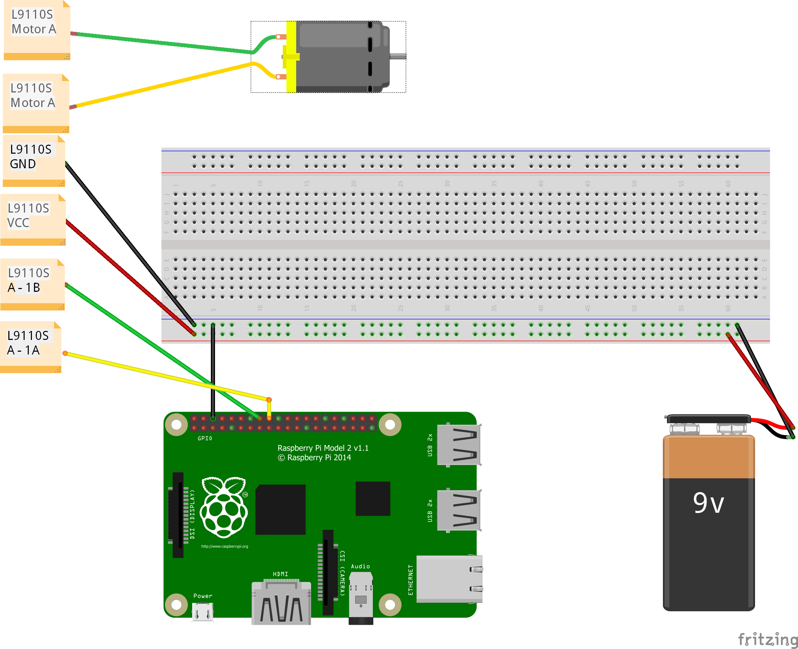

# raspberry-pi-dc-motor-pwm

This is one of my first Raspberry Pi laborations. I have an idea 
to create an automatic fish feeder for the familys aquarium to feed
the fishes while Im not home. That's why I wan't to understand how to
control the dc motor.

The program is really simple and it starts the motor in forward direction
with the speed of 50. And then it changes to the reverse direction in the
same speed.

I hope this can help someone else since I had some problem finding out how
to setup my hardware. And sorry for not finding a fritzing component for L91105. ;)

Components used:
* Raspberry Pi 2
* 9V battery
* [L9110S DC STEPPER MOTOR DRIVER H-BRIDGE](http://hobbycomponents.com/motor-drivers/264-l9110s-dc-stepper-motor-driver-h-bridge)
* [130 MOTOR ECO-FRIENDLY 6V-12V MICRO DC MOTOR](http://hobbycomponents.com/motors-and-servos/345-130-motor-eco-friendly-6v-12v-micro-dc-motor)
* Cables and breadboard



## To run
```
python motor.py
```